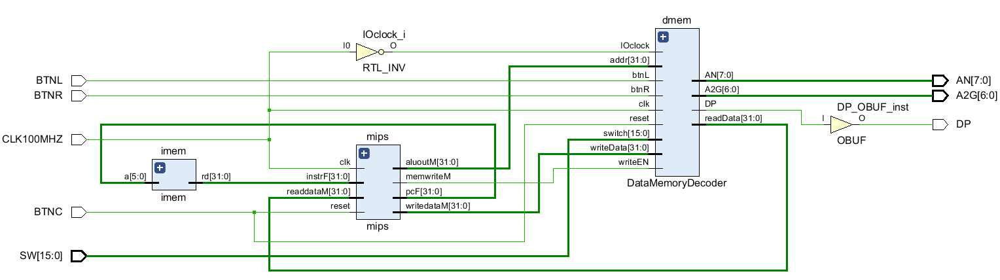
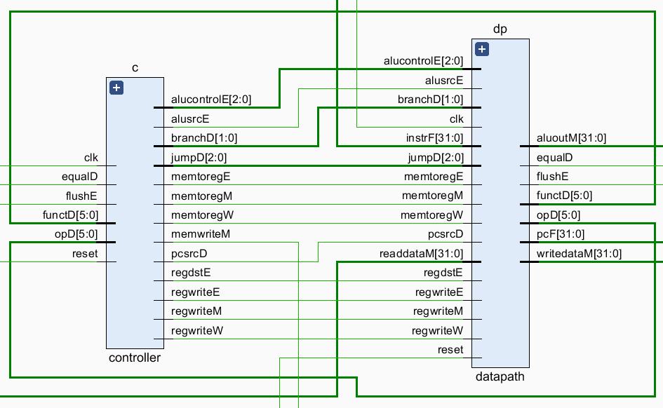
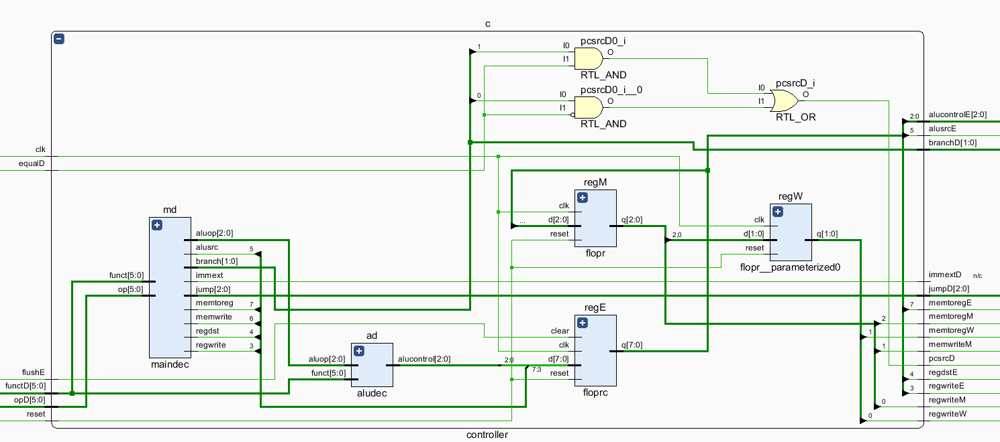
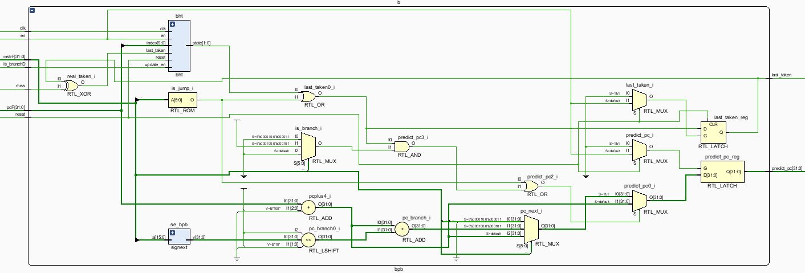
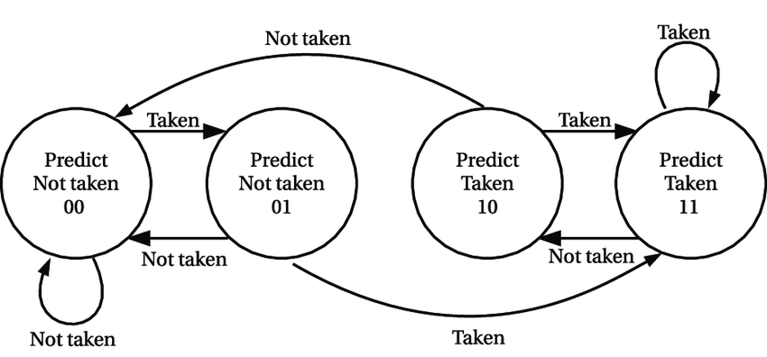
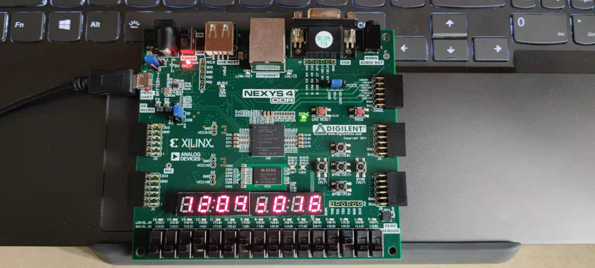
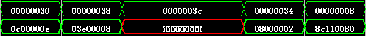

# MIPS_Pipeline

## 1. MIPS指令集

### 1.1 实现的指令集

```assembly
add     $rd, $rs, $rt                   # [rd] = [rs] + [rt]
sub     $rd, $rs, $rt                   # [rd] = [rs] - [rt]
and     $rd, $rs, $rt                   # [rd] = [rs] & [rt]
or      $rd, $rs, $rt                   # [rd] = [rs] | [rt]
slt     $rd, $rs, $rt                   # [rd] = [rs] < [rt] ? 1 : 0
addi    $rt, $rs, imm                   # [rt] = [rs] + SignImm
andi    $rt, $rs, imm                   # [rt] = [rs] & ZeroImm
ori     $rt, $rs, imm                   # [rt] = [rs] | ZeroImm
slti    $rt, $rs, imm                   # [rt] = [rs] < SignImm ? 1 : 0
lw      $rt, imm($rs)                   # [rt] = [Address]
sw      $rt, imm($rs)                   # [Address] = [rt]
j       label                           # PC = JTA
jal     label                           # [ra] = PC + 4, PC = JTA
jr      $rs                             # PC = [rs]
beq     $rs, $rt, label                 # if ([rs] == [rt]) PC = BTA
bne     $rs, $rt, label                 # if ([rs] != [rt]) PC = BTA
```

其中，主要扩展了J类型指令，完成了`JAL`和`JR`指令，使得程序的跳转更加完整，能够保存当前指令的下一条指令的地址，从而完成`return`的操作。

## 2. 部件说明



上图为mips流水线的总览，mips从指令存储器中取指令，并在mips中进行译码运算等过程，最终写回数据存储器，并通过IO模块输出到LED上，整体思路与单周期和多周期一致，区别在于mips的实现。

```verilog
module top (
    // IO input
    input  logic        CLK100MHZ, BTNC, // BTNC FOR RESET
    input  logic        BTNL, BTNR,
    input  logic [15:0] SW,

    // IO output
    output logic [7:0]  AN,
    output logic        DP,
    output logic [6:0]  A2G
    );

    logic [31:0] pc, instr, readdata;
    logic [31:0] writedata,dataadr;
    logic IOclock, Write;
    // logic [31:0] resultW;

    assign IOclock = ~CLK100MHZ;
    imem imem(pc[7:2], instr);
    mips mips(CLK100MHZ, BTNC, pc, instr, Write, dataadr, writedata, readdata);
    DataMemoryDecoder dmem(CLK100MHZ, Write, dataadr, writedata, readdata,
                           IOclock, BTNC, BTNL, BTNR, SW, AN, DP, A2G);
endmodule
```

### 2.1 mips



在流水线CPU中，将mips执行指令的过程分为：Fetch, Decode, Execute, Memory, Writeback 5个过程。

- Fetch：取指阶段，从指令存储器中取指令，并计算`pc+4`，输出到下一阶段。
- Decode：译码阶段，对Fetch阶段取到的指令进行译码，从寄存器中取源操作数，并通过控制单元输出控制信号。在这一阶段，也会对branch指令是否跳转做判断，并计算跳转地址。同时，完成branch指令的数据重定向。
- Execute：执行阶段，对源操作数通过操作码对应的操作进行计算。这一阶段需要考虑数据重定向，jump指令的跳转，以及`JAL`指令的写寄存器操作。
- Memory：存储器阶段，读写数据存储器。
- Writeback：写回阶段，将数据写回寄存器文件中。

```verilog
module mips(
    input  logic        clk, reset,
    output logic [31:0] pcF,
    input  logic [31:0] instrF,
    output logic        memwriteM,
    output logic [31:0] aluoutM, writedataM,
    input  logic [31:0] readdataM
    );

    logic [5:0] opD, functD;
    logic       regdstE, alusrcE, pcsrcD;
    logic       memtoregE, memtoregM, memtoregW, regwriteE, regwriteM, regwriteW;
    logic [2:0] alucontrolE;
    logic       flushE, equalD;
    logic [1:0] branchD;
    logic [2:0] jumpD;
    logic       immextD;

    controller  c(
        clk,
        reset,
        opD,
        functD,
        flushE,
        equalD,
        memtoregE,
        memtoregM,
        memtoregW,
        memwriteM,
        pcsrcD,
        branchD,
        alusrcE,
        regdstE,
        regwriteE,
        regwriteM,
        regwriteW,
        jumpD,
        alucontrolE,
        immextD
        );
    
    datapath    dp(
        clk,
        reset,
        memtoregE,
        memtoregM,
        memtoregW,
        pcsrcD,
        branchD,
        alusrcE,
        regdstE,
        regwriteE,
        regwriteM,
        regwriteW,
        jumpD,
        alucontrolE,
        equalD,
        pcF,
        instrF,
        aluoutM,
        writedataM,
        readdataM,
        opD,
        functD,
        flushE
    );
    
endmodule
```

#### 2.1.1 controller



控制单元的实现与单周期的基本一致，不同的地方在于`pcsrc`控制信号的计算方式以及增加了一些输出信号的寄存器。

- `pcsrc`信号的计算：单周期的计算是通过alu的输出`zero`来控制的，如果有跳转信号且满足跳转条件，则`pcsrc`置为1。如果继续采用这种方式的计算，那么branch指令是否跳转的判断需要等到alu组件计算出结果后才能判断，从译码阶段到存储器阶段需要3个时钟周期，再冲刷流水线需要1个时钟周期，总共花费4个时钟周期。而如果在译码阶段就能够判断是否跳转，则只需要冲刷掉下一个时钟周期的指令，总共花费2个时钟周期。因此在译码阶段，加入了判断是否相等的组件，并输入到控制单元中，判断是否执行跳转。

  判断方式为：`pcsrcD = (branchD[1] & equalD) | (branchD[0] & ~equalD);`

- 输出信号寄存器：这一部分与流水线的工作原理有关，控制单元需要保存之前进入译码阶段的指令需要的信号，这些信号在指令后续的阶段也需要用到，通过3个寄存器来保存Execute、Memory、Writeback阶段的控制信号。

```verilog
module controller(
    input  logic        clk, reset,
    input  logic [5:0]  opD, functD,
    input  logic        flushE, equalD,
    output logic        memtoregE, memtoregM, memtoregW, memwriteM,
    output logic        pcsrcD, 
    output logic [1:0]  branchD,
    output logic        alusrcE,
    output logic        regdstE, regwriteE, regwriteM, regwriteW,
    output logic [2:0]  jumpD,
    output logic [2:0]  alucontrolE,
    output logic        immextD
    );

    logic [2:0] aluopD;
    logic       memtoregD, memwriteD, alusrcD, regdstD, regwriteD;
    logic [2:0] alucontrolD;
    logic       memwriteE;

    maindec md(opD, functD, memtoregD, memwriteD, branchD, alusrcD, regdstD, regwriteD, jumpD, aluopD, immextD);
    aludec  ad(functD, aluopD, alucontrolD);

    assign pcsrcD = (branchD[1] & equalD) | (branchD[0] & ~equalD);

    floprc #(8) regE(
        clk, reset, flushE,
        {memtoregD, memwriteD, alusrcD, regdstD, regwriteD, alucontrolD},
        {memtoregE, memwriteE, alusrcE, regdstE, regwriteE, alucontrolE}
    );

    flopr #(3) regM(
        clk, reset, 
        {memtoregE, memwriteE, regwriteE},
        {memtoregM, memwriteM, regwriteM}
    );

    flopr #(2) regW(
        clk, reset,
        {memtoregM, regwriteM},
        {memtoregW, regwriteW}
    );
endmodule

module maindec(
    input  logic [5:0]  op,
    input  logic [5:0]  funct,
    output logic        memtoreg, memwrite,
    output logic [1:0]  branch, //{branch, nbranch}
    output logic        alusrc,
    output logic        regdst, regwrite,
    output logic [2:0]  jump, //{jal, jr, j}
    output logic [2:0]  aluop,
    output logic        immext
    );
    logic [13:0] controls;
    assign {regwrite, regdst, alusrc, branch, memwrite,
            memtoreg, jump, aluop, immext} = controls;
    always_comb
        case(op)                   //  rr_a_bn_mm_jjj_aaa_i
            6'b000000: begin
                case(funct)
                    6'b001000: controls <= 14'b00_0_00_00_010_000_0;  // JR
                    default:   controls <= 14'b11_0_00_00_000_010_0;  // RTYPE
                endcase
            end
            6'b000010: controls <= 14'b00_0_00_00_001_000_0;  // J
            6'b000011: controls <= 14'b10_0_00_00_101_000_0;  // JAL
            6'b100011: controls <= 14'b10_1_00_01_000_000_0;  // LW
            6'b101011: controls <= 14'b00_1_00_10_000_000_0;  // SW
            6'b000100: controls <= 14'b00_0_10_00_000_001_0;  // BEQ
            6'b000101: controls <= 14'b00_0_01_00_000_001_0;  // BNE
            6'b001000: controls <= 14'b10_1_00_00_000_000_0;  // ADDI
            6'b001100: controls <= 14'b10_1_00_00_000_100_1;  // ANDI
            6'b001101: controls <= 14'b10_1_00_00_000_011_1;  // ORI
            6'b001010: controls <= 14'b10_1_00_00_000_101_0;  // SLTI         
            default:   controls <= 14'bxx_x_xx_xx_xxx_xxx_x;  // illegal op
        endcase
endmodule

module aludec(
    input  logic [5:0] funct,
    input  logic [2:0] aluop,
    output logic [2:0] alucontrol
);
    always_comb begin
        case (aluop)
            3'b000: alucontrol <= 3'b010; // ADD
            3'b001: alucontrol <= 3'b110; // SUB
            // 3'b010;  occupied by RTYPE
            3'b011: alucontrol <= 3'b001; // OR
            3'b100: alucontrol <= 3'b000; // AND
            3'b101: alucontrol <= 3'b111; // SLT
            default: case (funct)
                6'b100000: alucontrol <= 3'b010;    // ADD
                6'b100010: alucontrol <= 3'b110;    // SUB
                6'b100100: alucontrol <= 3'b000;    // AND
                6'b100101: alucontrol <= 3'b001;    // OR
                6'b101010: alucontrol <= 3'b111;    // SLT
                default:   alucontrol <= 3'bxxx;
            endcase
        endcase
    end
endmodule
```

#### 2.1.2 datapath

数据路径是与之前的cpu最不同的部分，根据流水线的特性，主要分为5个部分：Fetch、Decode、Execute、Memory和Writeback。

##### 2.1.2.1 Fetch

取指阶段主要做的事就是维护`pc`以及`pc+4`，用于指令存储器进行取指操作。

用2个寄存器将`pc+4`以及`instr`保存起来，在译码阶段使用。这里的寄存器的使能是`stallD`信号的取反，意味着如果没有stall才能写入，否则保存上一时钟周期的数值。

```verilog
// Fetch stage
flopenr #(32)   pcreg(
    clk,
    reset,
    ~stallF,
    real_pc_next,
    pcF
);

adder   pcadd1(
    pcF,
    32'b100,
    pcplus4F
);

flopenr #(32)   r1D(
    clk,
    reset,
    ~stallD,
    pcplus4F,
    pcplus4D
);

flopenrc #(32)  r2D(
    clk,
    reset,
    ~stallD,
    flushD,
    instrF,
    instrD
);
```

##### 2.1.2.2 Decode

译码阶段主要是将指令交给控制单元，以及跳转指令的寻址。

用了8个寄存器将`jump`, `pc+4`，源操作数，寄存器地址保存，在执行阶段使用。其中，寄存器地址的保存是为了执行阶段的数据重定向。

在这里，采用了静态分支预测，使用了`eqcmp`部件去判断两个源操作数是否相等，再交由控制单元判断是否跳转。若跳转，则需要冲刷流水线。同时，jump指令也是需要跳转的，因此也是需要冲刷流水线的，在译码时就判断是否需要冲刷流水线能够减少流水线的执行时间。

因为分支指令在译码阶段就需要判断两个源操作数是否相同，而如果寄存器还没有被写入，则需要数据重定向。这里用`foward`信号去表示。如果寄存器地址与存储器阶段写入寄存器地址一致，则将数据定向至译码阶段，从而减少流水线的停顿。详细内容将在hazard中介绍。

```verilog
// Decode Stage
signext     se(
    instrD[15:0],
    signimmD
);

sl2         immsh(
    signimmD,
    signimmshD
);

adder       pcadd2(
    pcplus4D,
    signimmshD,
    pcbranchD
);

mux2 #(32)  forwardadmux(
    srcaD,
    aluoutM,
    forwardaD,
    srca2D
);

mux2 #(32)  forwardbdmux(
    srcbD,
    aluoutM,
    forwardbD,
    srcb2D
);

eqcmp       comp(
    srca2D,
    srcb2D,
    equalD
);

assign opD = instrD[31:26];
assign functD = instrD[5:0];
assign rsD = instrD[25:21];
assign rtD = instrD[20:16];
assign rdD = instrD[15:11];

assign flushD = pcsrcD | (jumpD[0] | jumpD[1] | jumpD[2]);

floprc #(3)     jumpReg(
    clk,
    reset,
    flushE,
    jumpD,
    jumpE
);

floprc #(32)    pcplus4Reg(
    clk,
    reset,
    flushE,
    pcplus4D,
    pcplus4E
);

floprc #(32)    r1E(
    clk,
    reset,
    flushE,
    srcaD,
    srcaE
);

floprc #(32)    r2E(
    clk,
    reset,
    flushE,
    srcbD,
    srcbE
);

floprc #(32)    r3E(
    clk,
    reset,
    flushE,
    signimmD,
    signimmE
);

floprc #(5)     r4E(
    clk,
    reset,
    flushE,
    rsD,
    rsE
);

floprc #(5)     r5E(
    clk,
    reset,
    flushE,
    rtD,
    rtE
);

floprc #(5)     r6E(
    clk,
    reset,
    flushE,
    rdD,
    rdE
);
```

##### 2.1.2.3 Execute

执行阶段，对操作数 `srca`, `srcb` 使用 ALU 执行计算。

用3个寄存器保存ALU输出、写入数据以及写入寄存器的地址，用于Memory写数据。

执行阶段需要用到数据重定向，如果用到上一条指令写入的寄存器，则需要数据重定向。

这个阶段还需要对操作数，写入的数据以及写入的寄存器地址进行判断：

- 操作数的判断：

  - 若需要数据重定向，则采用数据重定向中的数据。
  - 若指令是`JAL`指令，则采用当前指令的`pc+4`地址。
  - 若需要使用立即数，则采用立即数模块产生的输出。

- 写入的数据由重定向后的`srcb`或者`pc+4`组成，由`jumpE[2]`控制。

- 写入的寄存器地址：

  - `srcb`的地址
  - 目标寄存器的地址
  - `$ra`

  前两者由`regdstE`信号控制，后者是`JR`指令的情况，由`jumpE[1]`信号控制。

```verilog
mux4 #(32)      forwardaemux(
    srcaE,
    resultW,
    aluoutM,
    'x,
    forwardaE,
    srca2E
);

mux4 #(32)      forwardbemux(
    srcbE,
    resultW,
    aluoutM,
    'x,
    forwardbE,
    srcb2E
);

mux2 #(32)      writedatamux(
    srcb2E,
    pcplus4E,
    jumpE[2],
    writedataE
);

mux2 #(32)      srcbmux(
    writedataE,
    signimmE,
    alusrcE,
    srcb3E
);

alu             alu(
    srca2E,
    srcb3E,
    alucontrolE,
    aluoutE
);

mux4 #(32)      wrmux(
    rtE,
    rdE,
    5'b11111,           // $ra
    'x,
    {jumpE[2], regdstE},
    writeregE
);

flopr #(32)     r1M(
    clk,
    reset,
    writedataE,
    writedataM
);

flopr #(32)     r2M(
    clk,
    reset,
    aluoutE,
    aluoutM
);

flopr #(5)      r3M(
    clk,
    reset,
    writeregE,
    writeregM
);
```

##### 2.1.2.4 Memory

存储器阶段，当 `memwrite` 为 `1` 时，在 dmem 的目标地址 `aluout` 存储需要写入的数据 `writedata`。在datapath外部的dmem数据存储器中完成该操作。因此实际上在datapath中没有什么需要操作的地方。这一部分是由datapath与dmem的交互组成的。

```verilog
flopr #(32) r1W(
	clk,
	reset,
	aluoutM,
	aluoutW
);

flopr #(32) r2W(
	clk,
	reset,
	readdataM,
	readdataW
);

flopr #(32) r3W(
	clk,
	reset,
	writeregM,
	writeregW
);
```

##### 2.1.2.5 Writeback

写回阶段，由`memtoregW`信号控制写入寄存器文件的是ALU输出的值还是从存储器中读到的值。

```verilog
mux2 #(32)      resmux(
    aluoutW,
    readdataW,
    memtoregW,
    resultW
);
```

##### 2.1.2.6 Next PC logic

这一部分负责`pc`地址的选择

- branch地址：从Decode阶段取到值，信号`pcsrcD`取到1时，选择该地址。
- jump地址：
  - `{pcplus4D[31:28], instrD[25:0], 2'b00}`：`JAL`, `JR`指令的跳转地址计算方式，在jump信号中，这两个指令的最低位为1。
  - `$ra`：ra寄存器中的地址为`JR`指令的跳转地址，在jump信号中，该指令的第2位为1。
- 分支预测地址：由bpb单元输出，即预测出的下一条指令地址，若此时上一条的预测出错，或为`JR`指令（用寄存器中的值作为地址），则采用非预测的地址，否则采用预测地址。

```verilog
mux2 #(32)  pcbrmux(
    pcplus4F,
    pcbranchD,
    pcsrcD,
    pcnextbrFD
);

mux4 #(32)  pcmux(
    pcnextbrFD,
    {pcplus4D[31:28], instrD[25:0], 2'b00},
    srca2D,
    'x,
    jumpD[1:0],
    pcnextFD
);

mux2 #(32)  real_pc(
    predict_pc,
    pcnextFD,
    (predict_miss | jumpD[1]),
    real_pc_next
);
```

### 2.2 Branch Predictor



分支预测器用于预测跳转指令的地址以及是否跳转。在这里，我们采用2位的局部分支跳转预测作为我们预测的标准。

分支预测缓冲(Branch Predict Buffer)是预测器中的主要部分，输入Fetch阶段的指令、`pc`、上一条指令是否miss、上一条指令是否是分支指令，输出是否跳转以及跳转的预测出的地址。

BPB主要分为3个阶段：解析指令，更新Branch History Table，以及预测。

#### 2.2.1 解析指令

判断指令是否为branch类型或者jump类型，并计算对应的`pc+4`, `pc_branch`, `pc_jump`地址。根据指令的类型选择下一条指令是其中的哪一个。

```verilog
// Parse instr
logic [5:0]     op;
logic [31:0]    pc_jump, pc_branch, pcplus4, pc_next;
logic [31:0]    imm;
logic           is_branch, is_jump;

assign op = instrF[31:26];
signext se_bpb(
    instrF[15:0],
    imm
);
assign pcplus4 = pcF + 32'd4;
assign pc_jump = {pcplus4[31:28], instrF[25:0], 2'b00};
assign pc_branch = pcplus4 + (imm << 2);

always_comb begin
    case (op)
        6'b000010, 6'b000011: begin
            {pc_next, is_branch, is_jump} = {pc_jump, 2'b01};      // J, JAL
        end
        6'b000100, 6'b000101: begin
            {pc_next, is_branch, is_jump} = {pc_branch, 2'b10};    // BEQ, BNE
        end
        default: begin
            {pc_next, is_branch, is_jump} = {pcplus4, 2'b00};      // JR and others
        end
    endcase
end
```

#### 2.2.2 更新Branch History Table

Branch History Table是负责保存跳转指令以及对应的state，并输出预测的state的表格。

通过2位的表项记录每个分支指令的状态：



- 00: Strongly Not Taken
- 01: Weakly Not Taken
- 10: Weakly Taken
- 11: Strongly Taken

采用这种状态机的好处在于能够保持预测的稳定性，例如：在一个二重循环中，某一个分支指令到达内循环的边界跳出该内循环，此时状态由Strongly Taken变为Weakly Taken，下一次进入内循环时，状态机还是会输出Taken。

状态机由一个`state_switch`部件维护：

```verilog
module state_switch (
  input              last_taken,
  input        [1:0] prev_state,
  output logic [1:0] next_state
);
  always_comb begin
    unique case (prev_state)
      2'b00:   next_state = last_taken ? 2'b01 : 2'b00;
      2'b11:   next_state = last_taken ? 2'b11 : 2'b10;
      default: next_state = last_taken ? prev_state + 1 : prev_state - 1;
    endcase
  end
endmodule
```

更新时，需要一个更新使能让表格进行更新，该使能实际上就是Decode阶段中的branch信号，若不是branch信号，也不需要进行修改，以免弄脏数据。

最后，输出的预测状态其实就是指令对应的index的表项。

```verilog
module bht #(
    parameter SIZE_WIDTH = 10,
    parameter INDEX_WIDTH = 10
) (
    input  logic                    clk,
    input  logic                    reset,
    input  logic                    en,
    input  logic                    update_en,
    input  logic                    last_taken,
    input  logic [INDEX_WIDTH-1: 0] index,
    output logic [1:0]              state
);
    localparam                  SIZE = 2 ** SIZE_WIDTH;
    logic [1:0]                 entries[SIZE-1 : 0];
    logic [1:0]                 entry;
    logic [INDEX_WIDTH-1 : 0]   last_index;

    state_switch sw(
        last_taken,
        entries[last_index],
        entry
    );

    always_ff @(posedge clk) begin
        if (reset) begin
            entries <= '{default: '0};
            last_index <= 0;
        end
        else if (en) begin
            if (update_en)
                entries[last_index] <= entry;
            last_index <= index;
        end
    end

    assign state = entries[index];
endmodule
```

#### 2.2.3 预测

预测是否跳转：根据状态的高位以及是否为jump类型指令决定，若有一个为真，则预测跳转。

预测地址：采用跳转地址还是正常的`pc+4`根据`is_jump | (last_taken & is_branch)`判断，即若为jump或者branch且预测为真时，跳转。

```verilog
// Predict
always_comb begin
    if (reset) begin
        last_taken <= 0;
    end
    else if (en) begin
        last_taken = state[1] | is_jump;
        predict_pc = is_jump | (last_taken & is_branch) ? pc_next : pcplus4;
    end
end
```

### 2.3 Hazard Unit

冲突分为数据冲突和控制冲突

- 数据冲突
  - 大部分的数据冲突可以由数据重定向解决
    - 重定向到Decode阶段：判断译码阶段的寄存器地址是否与存储器阶段写入的寄存器地址是否相等，并且`regwrite`信号为1，则满足了重定向的条件。
    - 重定向到Execute阶段：判断方式与上述方式相同，但需要判断是与Memory阶段还是Writeback的寄存器地址相同。
  - `LW`指令读到的数据是在Memory阶段出现在数据路径中的，因此调用该寄存器的指令需要stall一个时钟周期，条件为`memtoregE & (rtE == rsD | rtE == rtD)`
  - 数据冲突中的另一部分主要是由branch指令和`JR`指令造成的
    - branch指令的数据冲突是由于在Decode阶段就需要判断是否执行分支指令，若当前需要的寄存器数据还在执行或者存储器阶段，则需要stall才能保证数据的正确性。
    - `JR`指令的造成的数据冲突也来自于寄存器的冲突，也是在Decode阶段就需要数据。

- 结构冲突

  结构冲突来自于branch分支指令和jump跳转指令，以及预测分支发生错误时，在最坏情况下可以由一次stall和一次flush完成。

  - 对于分支指令，若预测发生错误，则此时该分支指令已经进入了Execute阶段，则需要冲刷Decode和Execute阶段的数据，并重新取指。
  - 对于跳转指令，预测不会出错，只有`JR`指令因为需要读取寄存器中的数值，不能在Fetch阶段直接完成，bpb中直接取下一条指令，因此在Decode阶段取得值之后，冲刷Decode阶段的流水线。

```verilog
module hazard(
    input  logic [4:0] rsD, rtD, rsE, rtE,
    input  logic [4:0] writeregE, writeregM, writeregW,
    input  logic       regwriteE, regwriteM, regwriteW,
    input  logic       memtoregE, memtoregM,
    input  logic [1:0] branchD,
    input  logic [2:0] jumpD,
    input  logic       predict_miss,
    output logic       forwardaD, forwardbD,
    output logic [1:0] forwardaE, forwardbE,
    output             stallF, stallD, flushE, flushD
);

	logic lwstallD, branchstallD;

	assign forwardaD = (rsD != 0 & rsD == writeregM & regwriteM);
	assign forwardbD = (rtD != 0 & rtD == writeregM & regwriteM);

	always_comb begin
	    forwardaE = 2'b00;
	    forwardbE = 2'b00;
	    if (rsE != 0) begin
	        if (rsE == writeregM & regwriteM)
	            forwardaE = 2'b10;
	        else if (rsE == writeregW & regwriteW)
	            forwardaE = 2'b01;
	        else begin
	            forwardaE = 2'b00;
	        end
	    end
	    if (rtE != 0) begin
	        if (rtE == writeregM & regwriteM)
	            forwardbE = 2'b10;
	        else if (rtE == writeregW & regwriteW)
	            forwardbE = 2'b01;
	        else begin
	            forwardbE = 2'b00;
	        end
	    end
	end
	
	assign lwstallD = memtoregE & (rtE == rsD | rtE == rtD);
	assign branchstallD = (branchD[0] | branchD[1] | jumpD[1]) & 
	    ((regwriteE & (writeregE == rsD | writeregE == rtD)) |
	     (memtoregM & (writeregM == rsD | writeregM == rtD)));
	
	assign stallD = lwstallD | branchstallD;
	assign stallF = stallD;
	assign flushE = stallD | predict_miss;
	assign flushD = predict_miss | jumpD[1];

endmodule
```

## 3. 结果分析

### 3.1 硬件运行结果



### 3.2 jump指令结果


通过观察Decode阶段的指令：`JAL 0x000000E`, `JR $ra`, `J 0x0000002`可以看到：`JAL`指令后冲刷流水线；`JR`指令等待寄存器进行一次stall并冲刷流水线；`J`指令冲刷一次流水线，都得到了正确的结果以及正确的指令。

### 3.3 Branch Predictor测试



上图为Fetch阶段的pc以及instr，可以看到在30地址取到`JAL`指令后直接跳转到38地址取得`JR`指令，此时预测错误地址为3c，超出范围，Decode阶段发现寄存器还没有被写，进行一次stall，再进行一次flush，回到正确的指令地址34取地`J`指令，预测到正确的地址08。这一部分的指令说明了在BPB中，jump指令被很好的预测了。

